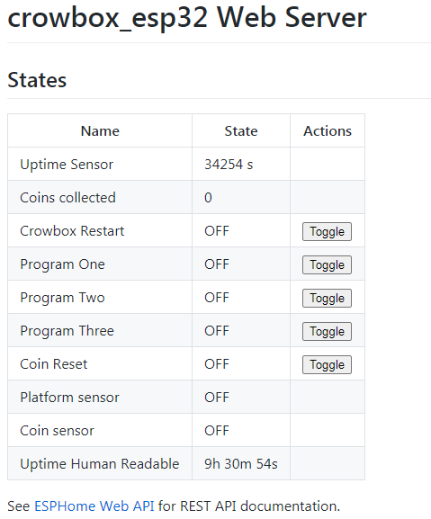
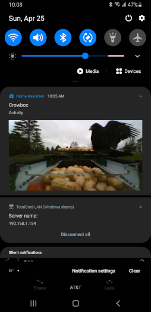

# HA_Crowbox
CrowBox for Home Assistant (HA)

This is my take on the crOS from the http://www.thecrowbox.com/ with intergration for control and monitoring from Home Assistant.
Currently there are three levels for training that match the crOS plan.
  1. Food freely available.
  2. Food available when bird lands on the platform, and triggers the switch.
  3. Food available when the bird lands on the platform and deposits a coin (provided or supplied)

HA CrowBox supports an Arduino ESP8266 and, an Arduino ESP32. Programming of the ESP is done thru the ESPHome add-on for Home Assistant, but could be flashed to an ESP with a default bin file.

By using Home Assistant, the sensors can be monitored, and the three training levels turned on or off remotly along with restarting the Arduino. The ESP is configured to work as an ad-hoc wifi accesspoint or as a client connecting to a wifi router. The lite webserver also allows you to monitor and control the Arduino with OR without using Home Assistant.

Future plans:
  - load cell to record the birds weight and/or prevent the platform from opening with to many birds on the CrowBox or prevent non-birds from accessing it. (work in progress)
  - webcam to view live updates and possible object detection. (This is currently done using an external ESP CAM)
  - notification sent to cell phone when sensors are triggered, to include a pic or video. (This is done using Home Assistant Automations)
  
  

